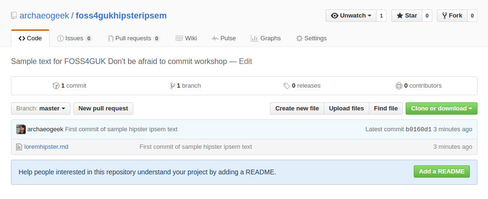
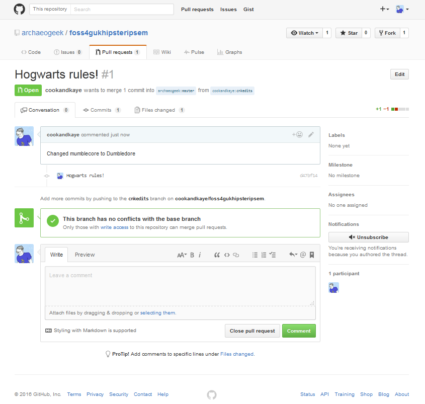
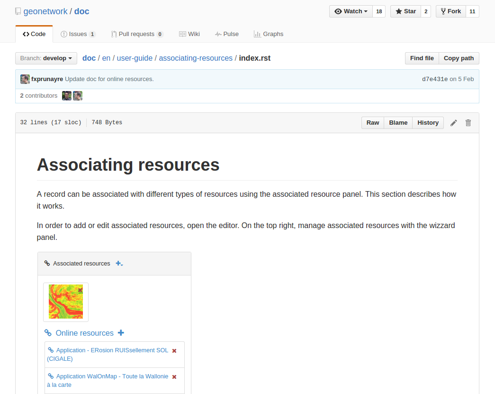
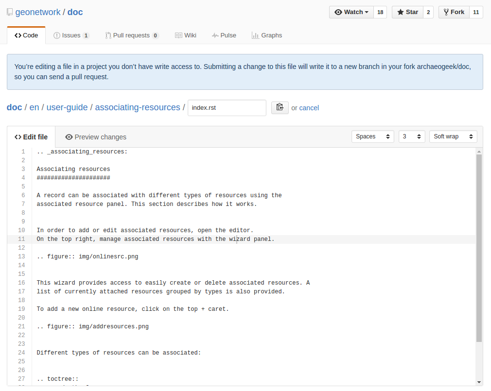
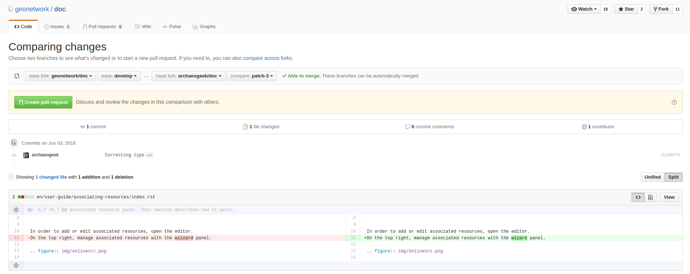

# How to submit a pull request

Generally speaking, we only have permission to make changes to our own repositories on GitHub, so any collaboration with a repository owned by someone else must go via our own copy or fork of their code.

The basic workflow is as follows:

 * Copy or fork the remote repository using your GitHub account
 * Download or clone your copy of the repository to your local filesystem
 * Create a new branch to work on your changes
 * Make your changes locally and upload or push the changes to your remote copy of the repository
 * Tell the original repository owner about your changes, or make a pull request
 * if there are no conflicts with the original code, get your changes merged, or your pull request accepted

Visit [github.com/archaeogeek/foss4gukhipsteripsem](https://github.com/archaeogeek/foss4gukhipsteripsem) and click the "fork" button to make a copy of the repository under your own GitHub account.

Navigate to your copy of the repository and click the green "Clone or download" button. Click the clipboard next to the https clone URL to copy it.

At your command prompt, change to your top level git repositories directory (that we created at the start of [Creating your first local repository](repository.html)). Type the following:

	git clone <the pasted URL>

Hit return, and this should clone your copy of the hipsteripsem repository to your local machine, in a folder called foss4gukhipsteripsem. You can now work with your copy of the repository, making changes locally and pushing them to your copy. 

To create a new branch to work on, and switch to that branch, change to your new repository and type the following:

	git checkout -b <newbranchname>

*Note that it's good practice to create a branch for each specific feature or fix that you work on. It should also be concise, and clearly named.*

Make your change, commit it (adding a clear and concise commit message) and push it to your local copy of the repository on GitHub. You will need to set the origin for your new branch the first time you push it up, so use the following code:

	git push -u origin <newbranchname>

Navigate to the original GitHub repository, and you should see a big green button marked "Compare and pull request". 

Click that button and you will be taken to a page giving you the opportunity to describe your pull request and showing you the changes you have made.

Write a clear and concise subject and description for your change- as the owner of the repository will use this to decide whether to accept your change. Review your changes and when you are happy click the green "Create pull request button".

The next page checks whether there are any conflicts with the base branch. You are given one final chance to comment on the pull request but note this is a comment to the owner and not part of the request itself.

If the owner of the repository is happy with the change then they will merge it with the base branch. If they are not happy they may write a comment back to you asking you for further information or changes.

###A shortcut for fixing documentation###

If the documentation for some software is hosted on GitHub it's possible to make changes to it without cloning the repository to your local computer.

Navigate to the documentation for GeoNetwork Open Source at [http://geonetwork-opensource.org/manuals/trunk/eng/users/index.html](http://geonetwork-opensource.org/manuals/trunk/eng/users/index.html).

Each page contains a link to "Edit on GitHub".

If you spot a typo or something that needs clarifying you can click that link to be taken to the correct page in the documentation repository.

This shows an edit button, which forks the project in your GitHub account, creates a branch for the change and provides you with an editing window.

Make your change to the documentation, and fill in the boxes at the bottom of the page with a clear and concise subject and description of your change. Then click the green "Propose file change" button.

*Note that the GeoNetwork documentation is written in ReStructuredText format, or rst. Ensure you don't break the syntax with your change- see the [ReStructuredText Primer](http://docutils.sourceforge.net/docs/user/rst/quickstart.html) for reference.*

Proposing the file change will take you to the Pull Request review window where you can check your changes against the original file. If it all looks good, then click the green "Create pull request" button. 

This will give you one further chance to change your commit message, then hit the final "Create pull request" button and your pull request will be submitted.

