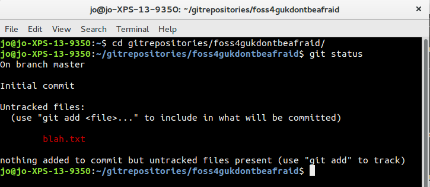
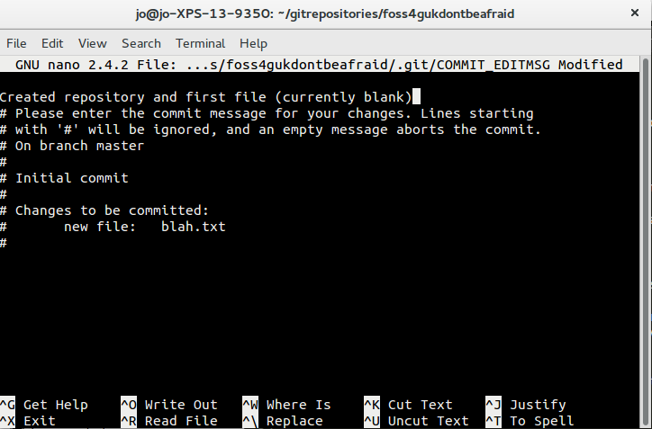
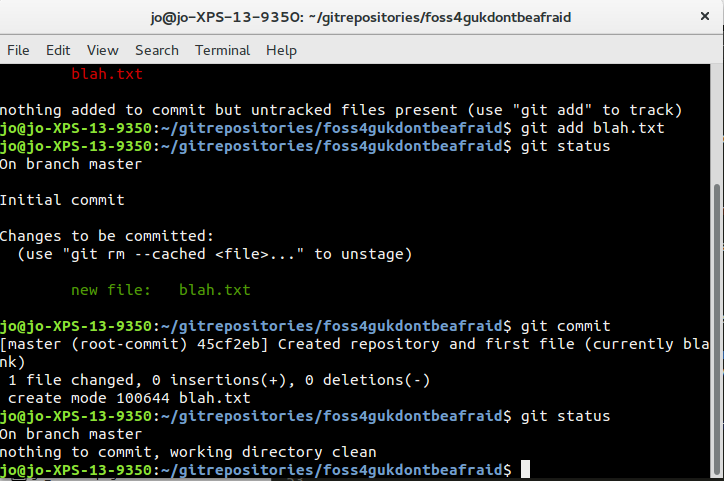
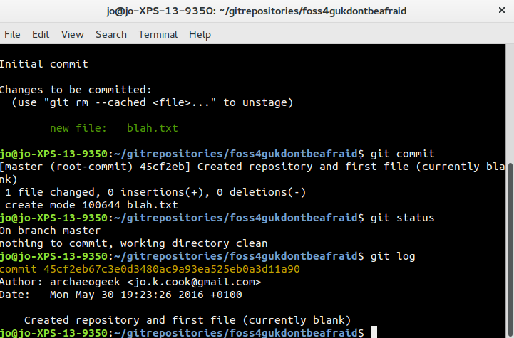
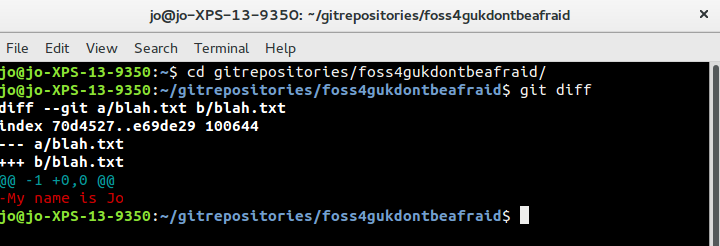

# Creating your first local repository

Folders and files are not version-controlled until we explicitly ask them to be. This process is called **initialising a repository**.

Firstly we need to create a folder to hold our files. We do this at the git command prompt using the following syntax:

	mkdir -p gitrepositories/foss4gukdontbeafraid

This creates a folder called gitrepositories and a sub-folder called foss4gukdontbeafraid in one step. 

**Where is this?**

If you don't specify a location for this folder, then it will use a default location as follows:

 * Linux: /home/yourname
 * Windows using Git Bash: C:\Users\yourname
 * Windows using GitHub Desktop: C:\Users\yourname\Documents\GitHub
 * Mac using Git from XCode: /Users/yourname
 * Mac using GitHub Desktop: 

Now change directory to foss4gukdontbeafraid:

	cd gitrepositories/foss4gukdontbeafraid

Initialise it as a repository:

	git init

This might not appear to do anything but it creates a hidden folder called .git inside foss4gukdontbeafraid that contains the information Git needs to track your repository.

* On windows, change your folder preferences to "always view hidden folders" so you can see this folder*

That's all we can do until we start adding some files and making changes to them, so let's make a file:

	touch blah.txt

This creates a blank text file called "blah.txt" in the folder.

At this point, we have enough in place to start committing to our repository.

##The three stages of Git##

Files in a repository go through three stages before being under version control with git:

 * Untracked: the file exists, but is not part of git's version control
 * Staged: the file has been added to git's version control but changes have not been committed
 * Committed: the change has been committed

Git-status is used to understand what stage the files in a repository are at.

	git status

The output of this command not only tells you the stage of the files in your repository but also gives you some handy tips on what to do next.

So our next stage is to add our files to the staging area:

	git add blah.txt

If we re-run the git status command at this point the output has changed:

The final stage is to commit the change we have made. We do this by recording a short message that explains what we did and why. This human-readable explanation will go alongside Git's own record of the change and the file structure snapshot at that point.

	git commit

This pops open your default text editor (depending on what you configured in your setup stage) and asks for a commit message. The screenshot below shows an example using the nano editor on linux:

Once your commit message has been saved and you are back at your git command prompt, you will see a summary of the changes git has made. Running git status again will tell you that your "working directory is clean", in other words you have no untracked files or uncommitted changes:

_Note that we can shorten these steps slightly using the -m flag to the git commit statement. Staging and committing can therefore be done in one go using the following syntax:_

	git commit -m"First commit of currently blank text file"

Also, running git log will give you a nicely formatted record of your changes:

	git log

**Note that long string of characters and numbers. That's an unique ID, or SHA, for that particular commit. You might sometimes need to refer to this!**

Let's make a change to the file so we can try out some other commands...

In your text editor of choice, add a line to blah.txt that says what your name is, and save the file.

We can view the difference between that version of the file and the committed one (eg the changes) using the following command:

	git diff

This should give output similar to the following:

Again we need to add this file to the staging area and then commit it's changes. Since the file is already in the repository, we can use another shortcut to add it and commit it in one go:

	git commit -am"Added name to blah.txt"

Running git diff again should show no changes, as the file and repository are up to date.

One useful command in this section is the "--amend" flag for git commit, which allows you to amend the previous commit, for example to fix a spelling mistake.

	git commit --amend

##Ignoring files##

There are many scenarios where you might end up with files in your repository that you don't want to place under source control. These might be backup files that text editors create, compiled python files (.pyc) or even files with sensitive information in, such as passwords. You can place these in a file called .gitignore (which will be hidden by default).

##Removing and renaming files##

Git uses the unix mv (move or rename) and rm (remove) commands, but also deals with the tasks of staging and unstaging the files too.

It's important to note that running git rm on a file will not remove it from your file system, it will simply unstage it. The following commands do different things:

	git rm file #unstages file but doesn't remove it from the file system
	git rm --cached file #
	git rm -f file # unstages and removes file?

